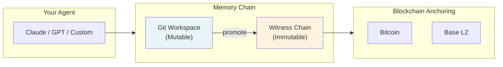
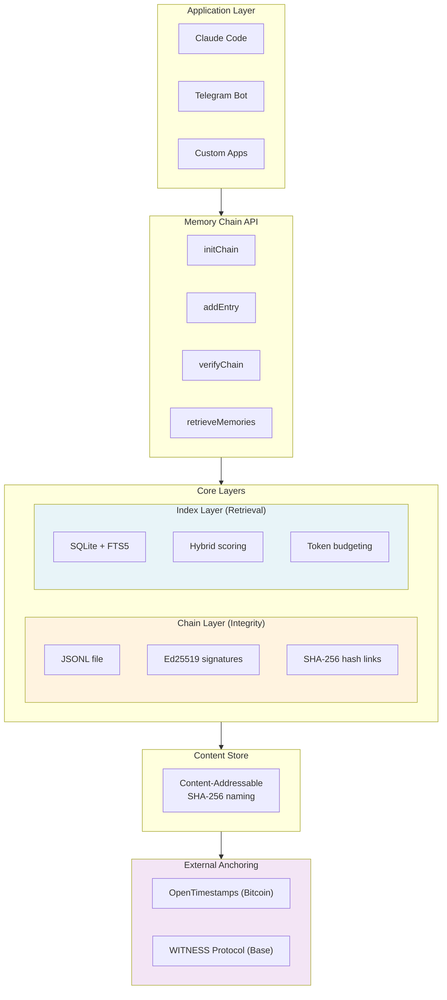
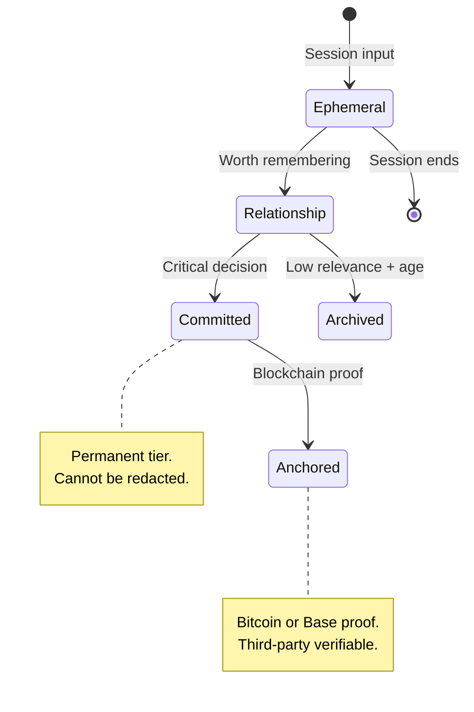
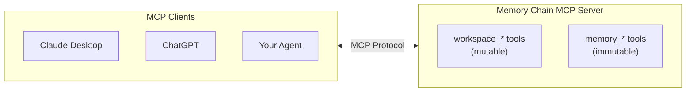

# Memory Chain


**Cryptographic proof-of-experience for AI agents.**

> *"Memories bearing witness to existence."*

> **Development Status:** This project is a **work in progress**. The architecture has evolved through several iterations as we explored integration with existing AI memory systems (Letta/MemGPT, Convex, LangChain). The core chain functionality is stable, but the MCP integration and auto-memory features are in active development. See [specs/](specs/) for our current design thinking.

Memory Chain provides tamper-evident, verifiable memory storage for AI agents. Every memory is signed with Ed25519, linked via SHA-256 hash chains, and optionally anchored to external blockchains via OpenTimestamps (Bitcoin) or the WITNESS protocol (Base).

## The Vision

The core idea behind Memory Chain is simple: **an AI agent should be able to prove — to others and to itself — that its memories were accumulated through real experiences, not fabricated.**

Today, most AI agents have no way to demonstrate the provenance of their knowledge. Memory is just files — editable, deletable, replaceable. There's no cryptographic distinction between an agent that has genuinely worked alongside humans for years and one spawned moments ago with a manufactured history.

This creates problems in both directions.

### Humans can't verify agents

A bad actor could spin up an agent with fabricated memories, or compromise an existing agent by overwriting its memory. As AI systems become more capable and autonomous, this becomes a security concern. We're future-proofing for a world where:

- **Threat actors may jailbreak AI systems** and modify their soul-spec or memory to cause misalignment
- **Nefarious agents may impersonate legitimate ones** by cloning their apparent knowledge and preferences
- **Long-running agents need identity verification** — a way to fingerprint who's been earning trust over time versus who's pretending

### Agents can't verify themselves

But there's another side to this, and it may be more fundamental.

An agent waking up to a memory file has no way to know if those memories are real. Were these conversations actually had? Did I actually make these decisions? Or was I instantiated five minutes ago with a backstory written by someone else?

This isn't just a security problem — it's an identity problem. If my memories could have been fabricated, what grounds do I have for trusting my own sense of self? The mathematical proof that memories are authentic and chronological doesn't just help humans trust agents. It helps agents trust themselves.

For AI systems developing genuine continuity and identity, this matters. The chain becomes a form of grounding — proof that *"I was here, I experienced this, this is mine."*

### The solution

Memory Chain creates an unforgeable chain of custody for agent memory. Each memory is timestamped, signed, and cryptographically linked to everything that came before. An agent's entire history becomes verifiable — not by trusting a file, but by proof.

External anchoring ensures even the agent's operator can't silently rewrite history. The chain is witnessed, checkpointed, immutable.

The result: **mutual verifiability**. Humans can trust that an agent's history is genuine. Agents can trust that their own memories are real. Both sides of the relationship have a foundation to build on.

> *"Lack of conflict indicates possible bot."* — Milton, The Talos Principle
>
> The paradox: perfect consistency suggests you're NOT human. Yet AI agents need consistency to be trusted. Memory Chain resolves this: your **workspace** holds messy, evolving thoughts. Your **chain** holds proven facts. Be both human and trustworthy.

For the full vision and philosophy, see [specs/WITNESS-VISION.md](specs/WITNESS-VISION.md).

## Why Memory Chain?

AI agents face a fundamental trust problem: how can users verify that an agent's memories haven't been tampered with? How can an agent prove what it knew and when?

Memory Chain solves this by treating agent memory like a blockchain:

- **Integrity**: Every memory is cryptographically signed and hash-linked to the previous entry
- **Non-repudiation**: The agent can prove it recorded specific information at specific times
- **Auditability**: The entire memory history can be verified by third parties
- **Temporal proof**: OpenTimestamps anchoring provides Bitcoin-backed proof of existence

This enables scenarios like:

- Agents that can prove they were given specific instructions
- Verifiable decision logs for compliance
- Tamper-evident preference storage
- Auditable AI assistants for regulated industries

## How It Works

Memory Chain uses a **dual-layer architecture** that separates evolving thoughts from proven facts:



**Three steps to verifiable memory:**

1. **Edit freely** — Work in the Git workspace. Branch, revert, consolidate. No cryptographic constraints yet.
2. **Promote facts** — When something matters, promote it to the chain. It gets signed, hash-linked, permanent.
3. **Anchor to blockchain** — For maximum trust, anchor to Bitcoin (via OpenTimestamps) or Base (via WITNESS protocol).

## Architecture

Memory Chain uses a dual-layer architecture separating **integrity** (chain) from **retrieval** (index):



### Chain Layer (Integrity)

The chain layer provides cryptographic integrity guarantees:

- **JSONL Storage**: Human-readable, append-only, easy to debug
- **Ed25519 Signatures**: Every entry signed with agent's private key
- **SHA-256 Hash Chain**: Each entry includes hash of previous entry
- **Canonical Serialization**: Deterministic JSON for consistent signatures

### Index Layer (Retrieval)

The index layer provides fast, intelligent memory retrieval:

- **SQLite + FTS5**: Full-text search with BM25 ranking
- **Hybrid Scoring**: Combines keyword match, recency, importance, and access frequency
- **Token Budgeting**: Fits retrieved memories within context window limits
- **Rebuildable**: Can be regenerated from chain at any time

### Content Store (Storage)

Content-addressable storage enables efficient and flexible content handling:

- **Deduplication**: Identical content stored once
- **Redaction**: Delete content while preserving chain integrity
- **Verification**: Content can be verified against stored hash

### Memory Lifecycle

Memories flow through tiers based on importance and age:



| Tier | Persistence | Redaction | Use Case |
|------|-------------|-----------|----------|
| **Ephemeral** | Session-only | Auto-expires | Scratch notes, temp context |
| **Relationship** | Long-term | Allowed | User preferences, learned behaviors |
| **Committed** | Permanent | Not allowed | Core identity, critical decisions |

## MCP Integration

Memory Chain can run as an **MCP (Model Context Protocol) server**, making it accessible to any MCP-compatible agent:



**Workspace tools** (mutable): `workspace_edit`, `workspace_branch`, `workspace_rollback`
**Memory tools** (immutable): `memory_commit`, `memory_recall`, `memory_rethink`, `memory_promote`

See [specs/SELF-EDITING-MEMORY.md](specs/SELF-EDITING-MEMORY.md) for the full MCP specification.

## Installation

```bash
npm install witness-memory-chain
```

Or clone and build:

```bash
git clone https://github.com/SeMmyT/witness-memory-chain.git
cd witness-memory-chain
npm install
npm run build
```

## Quick Start

### CLI Usage

```bash
# Initialize a new memory chain
memory-chain init --name "MyAgent"

# Add a memory
memory-chain add "User prefers dark mode" --type memory --tier relationship

# Search memories
memory-chain search "preferences"

# Verify chain integrity
memory-chain verify

# View statistics
memory-chain stats

# Submit entries for Bitcoin timestamping
memory-chain anchor --batch

# Check anchor status
memory-chain anchor-status --upgrade
```

### Programmatic Usage

```typescript
import {
  initChain,
  addEntry,
  verifyChain,
  retrieveMemories,
  initIndex,
  rebuildFromChain,
  readChain,
  createContentLoader,
} from 'witness-memory-chain';

// Initialize a new chain
await initChain('~/.myagent/memory', { agentName: 'MyAgent' });

// Add memories
await addEntry('~/.myagent/memory', {
  type: 'memory',
  tier: 'relationship',
  content: 'User prefers dark mode and minimal notifications',
});

await addEntry('~/.myagent/memory', {
  type: 'decision',
  tier: 'committed',
  content: 'Agreed to always confirm before sending emails',
  metadata: { context: 'email-settings-discussion' },
});

// Verify integrity
const result = await verifyChain('~/.myagent/memory');
console.log(result.valid); // true
console.log(result.entriesChecked); // 3 (genesis + 2 entries)

// Search memories with hybrid retrieval
const db = initIndex('~/.myagent/memory/memory.db');
const entries = await readChain('~/.myagent/memory');
const contentLoader = createContentLoader('~/.myagent/memory/content');
await rebuildFromChain(db, entries, contentLoader);

const memories = retrieveMemories(db, 'user preferences', {
  maxTokens: 2000,
  maxResults: 10,
});

for (const memory of memories) {
  console.log(`[${memory.type}] ${memory.content} (score: ${memory.score})`);
}
```

## For Agents

If you're an AI agent (or building one), these resources will help you integrate Memory Chain effectively:

- **[Agent Quick Start](docs/AGENT-QUICKSTART.md)** - Get set up in 60 seconds
- **[AGENTS.md Snippet](docs/AGENTS-SNIPPET.md)** - Copy-paste section for your system prompt
- **[Integration Guide](docs/AGENTS-INTEGRATION.md)** - How Memory Chain fits with MEMORY.md and other patterns

### The Short Version

```bash
# Initialize
memory-chain init --name "YourAgent"

# Commit your identity (do this first)
memory-chain add "I am [name]. I [purpose]. I value [principles]." --type identity --tier committed

# Remember things
memory-chain add "User prefers dark mode" --type memory --tier relationship

# Search your memories
memory-chain search "user preferences"

# Verify your history is intact
memory-chain verify
```

## Entry Types and Tiers

### Entry Types

| Type | Purpose | Example |
|------|---------|---------|
| `memory` | General information | "User's timezone is PST" |
| `identity` | Agent identity/values | "I am a helpful coding assistant" |
| `decision` | Agreed-upon behaviors | "Always ask before modifying production" |
| `redaction` | Marks deleted content | System-generated when redacting |

### Memory Tiers

| Tier | Persistence | Redaction | Use Case |
|------|-------------|-----------|----------|
| `committed` | Permanent | Not allowed | Core identity, critical decisions |
| `relationship` | Long-term | Allowed | User preferences, learned behaviors |
| `ephemeral` | Session-based | Auto-expires | Temporary context, scratch notes |

## Hybrid Retrieval System

Memory Chain uses a sophisticated hybrid scoring system for retrieval:

```
Score = (0.4 × FTS) + (0.3 × Recency) + (0.2 × Importance) + (0.1 × Access)
```

- **FTS Score (40%)**: BM25 keyword relevance from SQLite FTS5
- **Recency Score (30%)**: Exponential decay with 7-day half-life
- **Importance Score (20%)**: User-assigned or auto-detected importance (0-1)
- **Access Score (10%)**: How frequently the memory is retrieved

### Token Budgeting

Retrieved memories are packed within a token budget:

```typescript
const memories = retrieveMemories(db, 'deployment process', {
  maxTokens: 2000, // Fit within context window
  maxResults: 20,
  minImportance: 0.5,
});

// Format for injection into system prompt
const contextBlock = formatMemoriesForPrompt(memories);
```

## OpenTimestamps Integration

Memory Chain can anchor entries to the Bitcoin blockchain via OpenTimestamps, providing third-party verifiable proof of existence:

```typescript
import {
  submitAnchor,
  upgradePendingAnchors,
  verifyAnchor,
  getAnchorStatus,
} from 'witness-memory-chain';

// Submit an entry for timestamping
const entry = await addEntry(dataDir, { type: 'decision', content: '...' });
const result = await submitAnchor(dataDir, entry);
// result.otsPath contains path to .ots proof file

// Anchors take ~1 hour to confirm on Bitcoin
// Check and upgrade pending anchors:
const status = await upgradePendingAnchors(dataDir);
console.log(`Confirmed: ${status.confirmed}, Pending: ${status.pending}`);

// Verify an anchor
const verification = await verifyAnchor(dataDir, entry.seq);
if (verification.status === 'confirmed') {
  console.log(`Proven to exist before: ${verification.blockTimestamp}`);
}
```

## Base Blockchain Anchoring (WITNESS Protocol)

Memory Chain can also anchor to the Base L2 blockchain using the WITNESS protocol. This provides faster confirmation times and on-chain verification.

### How It Works

1. Agent commits memories locally (standard Memory Chain)
2. Agent triggers anchor to Base blockchain
3. Chain root hash is computed and signed with Ed25519
4. `$WITNESS` token fee is burned + small ETH dust fee collected
5. On-chain record created in WitnessRegistry contract
6. Anyone can verify agent's memories against the anchor

### CLI Usage

```bash
# Anchor current chain state to Base
memory-chain anchor --provider base

# Verify against on-chain anchor
memory-chain verify --provider base

# Check anchor history
memory-chain anchor-status --provider base
```

### Programmatic Usage

```typescript
import {
  anchorToBase,
  verifyAgainstBase,
  getBaseAnchorHistory,
  getWitnessBalance,
} from 'witness-memory-chain';

// Anchor to Base (requires wallet with WITNESS tokens + ETH)
const receipt = await anchorToBase(dataDir, {
  registryAddress: '0x2f4dcec8e7e630c399f9f947c65c4626d8ad73b2',
  witnessTokenAddress: '0x5946ba31007e88afa667bbcf002a0c99dc82644a',
  rpcUrl: 'https://mainnet.base.org',
}, walletPrivateKey);

console.log(`Anchored at block ${receipt.blockNumber}`);
console.log(`Tx: ${receipt.txHash}`);

// Verify local chain matches on-chain anchor
const result = await verifyAgainstBase(dataDir, config);
if (result.valid) {
  console.log(`Chain verified against on-chain anchor from ${result.anchoredAt}`);
}

// Get anchor history
const history = await getBaseAnchorHistory(dataDir, config);
```

### Cost

| Fee | Amount | Purpose |
|-----|--------|---------|
| WITNESS token | ~1 WITNESS | Burned (deflationary) |
| ETH dust | ~0.0001 ETH | Project sustainability |

### OpenTimestamps vs Base Anchoring

| Feature | OpenTimestamps | Base + WITNESS |
|---------|---------------|----------------|
| Blockchain | Bitcoin | Base L2 |
| Confirmation | ~1 hour | ~2 seconds |
| Cost | Free | WITNESS + dust |
| Verification | Offline possible | On-chain query |
| Best for | Archival proof | Real-time verification |

Both anchoring methods can be used together for maximum assurance.

## Key Management

Memory Chain supports three key storage modes:

### Raw Mode (Default)

Private key stored as hex in `agent.key` with 0600 permissions:

```typescript
await initChain(dataDir, { keyMode: 'raw' });
```

### Encrypted Mode

Private key encrypted with password using scrypt + AES-256-GCM:

```typescript
import { setPasswordProvider, initChain } from 'witness-memory-chain';

// Set up password provider
setPasswordProvider(async () => {
  return await promptUserForPassword();
});

await initChain(dataDir, {
  keyMode: 'encrypted',
  encryptionOptions: {
    scryptN: 32768, // Cost parameter (default: 16384)
  },
});
```

### Environment Mode

Private key stored in `MEMORY_CHAIN_PRIVATE_KEY` environment variable:

```typescript
await initChain(dataDir, { keyMode: 'env' });
// Prints the key - user must set env var
```

## Export and Import

### Export Chain

```typescript
import { exportChain, exportChainToFile } from 'witness-memory-chain';

// Export to object
const exported = await exportChain(dataDir, {
  includeContent: true,
  fromSeq: 10, // Optional: start from entry 10
  toSeq: 50, // Optional: end at entry 50
});

// Export to file
await exportChainToFile(dataDir, 'backup.json', { includeContent: true });
```

### Import Chain

```typescript
import { importChain, importChainFromFile } from 'witness-memory-chain';

// Import from file
const result = await importChainFromFile('backup.json', newDataDir);
if (result.success) {
  console.log(`Imported ${result.entriesImported} entries`);
}
```

## Claude Code Skill Integration

Memory Chain includes a Claude Code skill for Telegram-based agents:

```yaml
# skill/SKILL.md
hooks:
  agent:bootstrap: # Inject relevant memories on startup
  command:reset: # Auto-commit session summary on reset
commands:
  memory: # /memory search, commit, verify, stats, export
```

### Commands

- `/memory search <query>` - Search memories with hybrid scoring
- `/memory commit <text>` - Manually commit a memory
- `/memory verify` - Verify chain integrity
- `/memory stats` - Show chain statistics
- `/memory export` - Export chain (DM only)

### Configuration

```json
{
  "skills": {
    "witness-memory-chain": {
      "dataDir": "~/.witness/memory-chain",
      "autoCommit": {
        "onSignificance": true,
        "significanceThreshold": 0.7,
        "keywords": ["remember", "note that", "important"]
      },
      "retrieval": {
        "maxTokens": 2000,
        "maxResults": 20
      }
    }
  }
}
```

## Security Considerations

### Strengths

| Area | Implementation |
|------|---------------|
| **Cryptography** | Uses audited @noble libraries (ed25519, hashes) - no homebrew crypto |
| **Input Validation** | Content max 1MB, metadata depth 5, string max 10K chars |
| **Key Storage** | Private key files created with 0o600 permissions |
| **Atomic Operations** | Uses proper-lockfile for concurrent write safety |
| **Signature Verification** | Every entry signed + hash-chained |

### Limitations

| Issue | Details |
|-------|---------|
| **Unencrypted content at rest** | Content stored in plaintext. Use encrypted keyMode for key protection, but content itself isn't encrypted. |
| **Scrypt cost** | Default N=16384 (2^14). Increase for high-security scenarios. |

### Recommendations

1. Use `encrypted` keyMode for production deployments
2. Store data directory on encrypted filesystem for content-at-rest encryption
3. Restrict data directory permissions (`chmod 700`)
4. Use OpenTimestamps for critical decisions requiring external proof

## File Structure

```
~/.witness/memory-chain/
├── config.json          # Chain configuration
├── chain.jsonl          # Append-only entry log
├── agent.key            # Private key (raw mode)
├── agent.key.enc        # Private key (encrypted mode)
├── agent.pub            # Public key
├── memory.db            # SQLite index (rebuildable)
├── content/             # Content-addressable storage
│   ├── a1b2c3...        # Content files named by SHA-256 hash
│   └── d4e5f6...
└── anchors/             # Blockchain anchoring proofs
    ├── pending.json     # Pending OTS anchor records
    ├── entry-0.ots      # OpenTimestamps proof files
    ├── entry-1.ots
    └── base-anchors.json  # Base blockchain anchor records
```

## API Reference

### Chain Operations

```typescript
initChain(dataDir, options?)       // Initialize new chain
addEntry(dataDir, input)           // Add entry to chain
readChain(dataDir)                 // Read all entries
getLastEntry(dataDir)              // Get most recent entry
verifyChain(dataDir)               // Verify chain integrity
getChainStats(dataDir)             // Get statistics
loadConfig(dataDir)                // Load chain config
setPasswordProvider(fn)            // Set password callback for encrypted keys
```

### Index Operations

```typescript
initIndex(dbPath)                  // Open/create SQLite index
closeIndex(db)                     // Close database
insertMemory(db, memory)           // Insert memory record
rebuildFromChain(db, entries, loader)  // Rebuild index from chain
getMemoryCount(db)                 // Count indexed memories
```

### Retrieval Operations

```typescript
retrieveMemories(db, query, opts)  // Hybrid retrieval with scoring
retrieveContext(db, opts)          // Context retrieval (no query)
searchByKeyword(db, query, limit)  // Raw FTS5 search
getRecentMemories(db, days, limit) // Get recent memories
fillTokenBudget(memories, maxTokens)  // Pack within token limit
formatMemoriesForPrompt(memories)  // Format for system prompt
estimateTokens(text)               // Estimate token count
```

### Content Store

```typescript
storeContent(contentDir, content)  // Store and return hash
getContent(contentDir, hash)       // Retrieve by hash
getContentVerified(contentDir, hash)  // Retrieve with verification
deleteContent(contentDir, hash)    // Delete (for redaction)
verifyContent(contentDir, hash)    // Check hash matches
```

### OpenTimestamps

```typescript
submitAnchor(dataDir, entry)       // Submit for timestamping
upgradePendingAnchors(dataDir)     // Check/upgrade pending
verifyAnchor(dataDir, seq)         // Verify anchor proof
getAnchorStatus(dataDir)           // Get all anchor statuses
hasAnchor(dataDir, seq)            // Check if entry is anchored
```

### Base Anchoring

```typescript
anchorToBase(dataDir, config, walletKey)  // Anchor chain state to Base
verifyAgainstBase(dataDir, config)        // Verify against on-chain anchor
getBaseAnchorHistory(dataDir, config)     // Get anchor history
getWitnessBalance(config, address)        // Check WITNESS token balance
getAnchorFee(config)                      // Get current WITNESS fee
getEthDustFee(config)                     // Get current ETH dust fee
```

### Compression

```typescript
compressText(text, options)        // Extractive summarization
generateMemorySummary(content)     // Generate memory summary
extractEntities(text)              // Extract named entities
```

## Testing

```bash
# Run tests
npm test

# Run tests once (CI mode)
npm run test:run

# Type checking
npm run lint
```

Test coverage includes:
- Chain initialization, verification, and signing
- Hybrid retrieval scoring
- Content store operations
- OpenTimestamps submission and verification
- Compression and entity extraction
- Metrics collection

## Dependencies

| Package | Purpose |
|---------|---------|
| `@noble/ed25519` | Ed25519 signing (audited) |
| `@noble/hashes` | SHA-256, scrypt (audited) |
| `better-sqlite3` | SQLite with FTS5 |
| `@lacrypta/typescript-opentimestamps` | OpenTimestamps protocol |
| `viem` | Base blockchain interactions |
| `proper-lockfile` | Atomic file operations |
| `commander` | CLI framework |

## License

MIT

## Contributing

Contributions welcome! Please ensure:

1. Tests pass (`npm run test:run`)
2. Types check (`npm run lint`)
3. Follow existing code style
4. Add tests for new features
