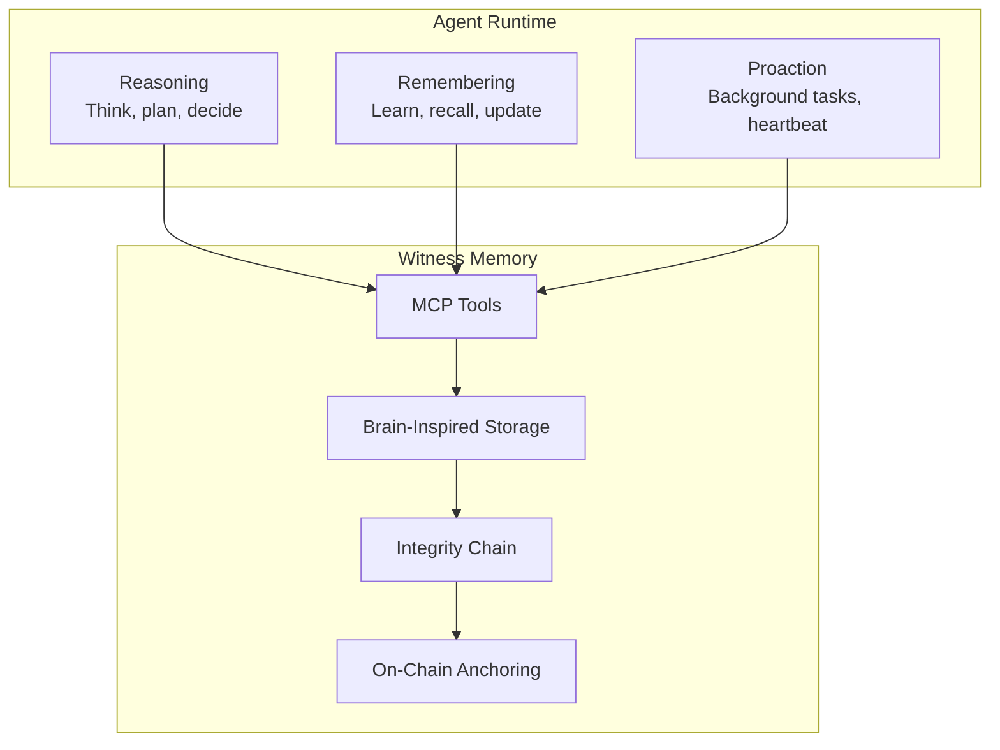
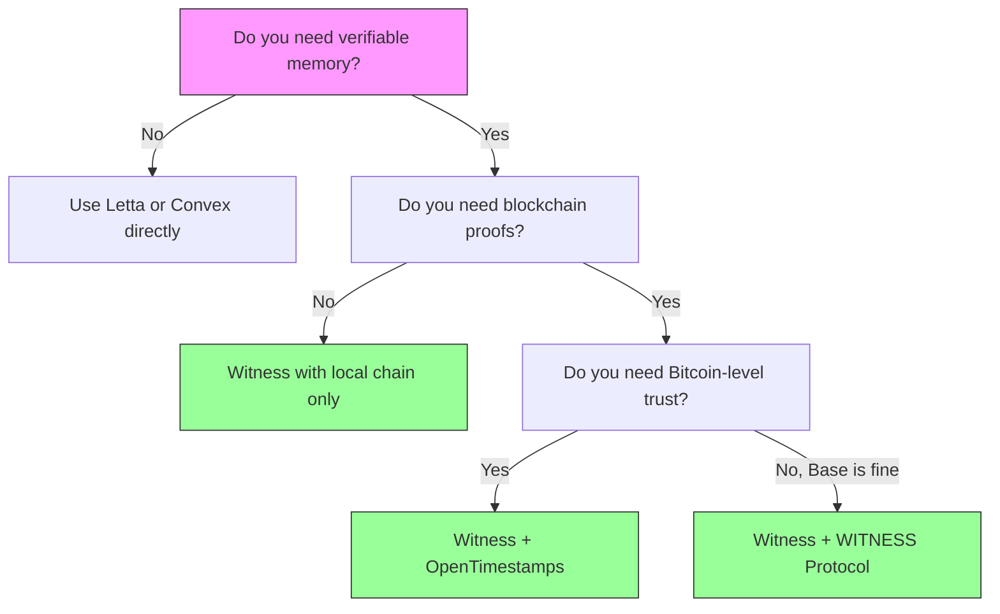

# Witness Memory System Discovery

You're exploring memory options for your agent. This skill helps you understand what Witness provides and whether it fits your needs.

## What is Witness?

Witness is a **verifiable memory layer** for AI agents. It provides:

```
┌─────────────────────────────────────────────────────────────────┐
│  YOUR AGENT                                                      │
│  (Any framework: Claude, ChatGPT, Gemini, Letta, custom)        │
└────────────────────────────┬────────────────────────────────────┘
                             │ MCP Protocol
                             ▼
┌─────────────────────────────────────────────────────────────────┐
│  WITNESS MEMORY                                                  │
│                                                                  │
│  ✓ Store memories with provenance (why did I remember this?)   │
│  ✓ Retrieve with brain-inspired decay (hot/warm/cold)          │
│  ✓ Consolidate like human sleep (synthesize understanding)     │
│  ✓ Prove what you knew and when (cryptographic chain)          │
│  ✓ Anchor to Bitcoin/Base blockchain (on-chain proof)          │
└─────────────────────────────────────────────────────────────────┘
```

## The Three Agent Functions

Witness supports all three core functions of an intelligent agent:



| Function | What It Does | Witness Tools |
|----------|--------------|---------------|
| **Reasoning** | Think, plan, make decisions | `memory_commit` stores decisions with context |
| **Remembering** | Learn from experience | `memory_recall`, `memory_rethink`, `block_update` |
| **Proaction** | Background self-maintenance | Heartbeat crons for consolidation, decay, anchoring |

## MCP Tools Available

Once you connect to Witness via MCP, you have these tools:

### memory_commit
Store something worth remembering.

```json
{
  "content": "User prefers dark mode and uses VS Code",
  "source": "manual",
  "trigger": "user_said",
  "importance": 0.8,
  "relatedEntities": ["user_profile", "preferences"]
}
```

### memory_recall
Search for relevant context.

```json
{
  "query": "user preferences",
  "maxTokens": 1000,
  "maxResults": 5
}
```

### memory_rethink
Consolidate fragmented memories (like brain's sleep consolidation).

```json
{
  "supersedes": [5, 8, 12],
  "newUnderstanding": "User is a TypeScript developer who prefers dark mode and uses VS Code",
  "reason": "Unified user profile from scattered observations"
}
```

### block_update
Update persistent context blocks.

```json
{
  "label": "user_profile",
  "content": "TypeScript developer, dark mode, VS Code user",
  "isCore": true
}
```

### memory_introspect
Understand why a memory exists.

```json
{
  "seq": 15
}
// Returns: source, trigger, supersession history, anchor proofs
```

## Comparison: When to Use What

| If You Need... | Use | Why |
|----------------|-----|-----|
| Quick prototype | Letta/Convex | Faster setup, integrated frameworks |
| Production agent | Letta + Witness | Letta tools + Witness integrity |
| Verifiable history | Witness | Only option with cryptographic proofs |
| Compliance/audit | Witness | Tamper-proof, anchored timestamps |
| Multi-framework | Witness MCP | Works with any MCP-compatible agent |

## Decision Tree



## Integration Patterns

### Pattern 1: Witness as Primary Memory
Agent uses Witness MCP server directly for all memory operations.

```
Agent → Witness MCP → Chain + Index
```

### Pattern 2: Witness as Integrity Layer
Agent uses Letta/Convex for memory, mirrors important events to Witness.

```
Agent → Letta → (important events) → Witness → Chain
```

### Pattern 3: Witness for Audit Trail
Agent operates normally, Witness captures decisions for compliance.

```
Agent → Normal ops
     ↘ Decisions → Witness → Chain → Blockchain anchor
```

## Quick Start

### Local (STDIO transport)
```bash
# Install
pnpm add @witness/mcp-server

# Run (Claude Desktop spawns this)
memory-chain mcp-server --transport stdio
```

### Remote (HTTP transport)
```bash
# Run server
memory-chain mcp-server --transport http --port 3000

# Agent connects to http://localhost:3000/mcp
```

## What Makes Witness Unique

Other memory systems store what you remember.
Witness **proves** what you knew and when.

| Feature | Standard Memory | Witness |
|---------|-----------------|---------|
| Storage | ✅ | ✅ |
| Search | ✅ | ✅ |
| "Why do I know this?" | ❌ | ✅ Provenance tracking |
| "Can you prove it?" | ❌ | ✅ Signed hash-chain |
| "When exactly?" | ❌ | ✅ Bitcoin/Base timestamps |
| "Was it modified?" | ❌ | ✅ Tamper-evident verification |

## Next Steps

1. **Try it locally**: `memory-chain init && memory-chain add "test"`
2. **Connect via MCP**: Add to your agent's MCP config
3. **Explore provenance**: Use `memory_introspect` to see memory origins
4. **Anchor important memories**: `memory-chain anchor --chain base`

## Resources

- Spec: `specs/SELF-EDITING-MEMORY.md`
- Protocol: `specs/WITNESS-PROTOCOL.md`
- Auto-Memory Plan: `PLAN-AUTO-MEMORY.md`
- Contracts: [BaseScan](https://basescan.org/address/0x2f4dcec8e7e630c399f9f947c65c4626d8ad73b2)
