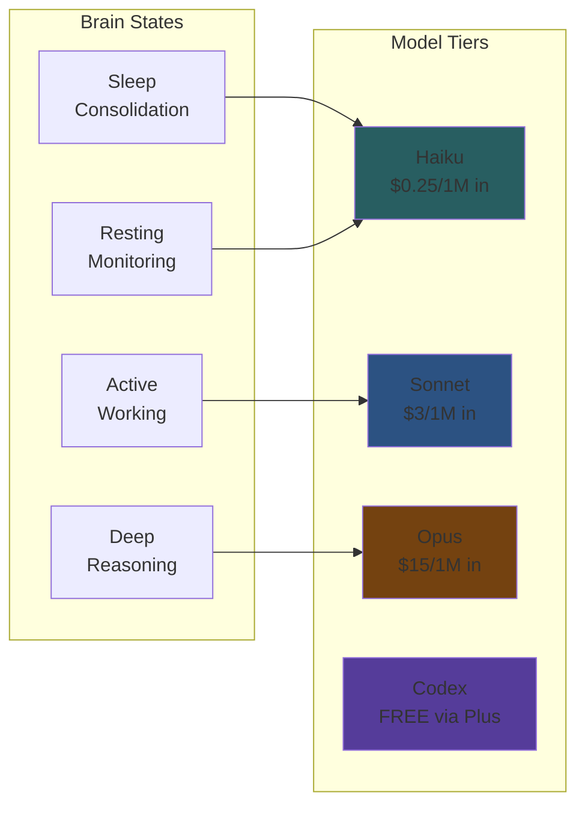
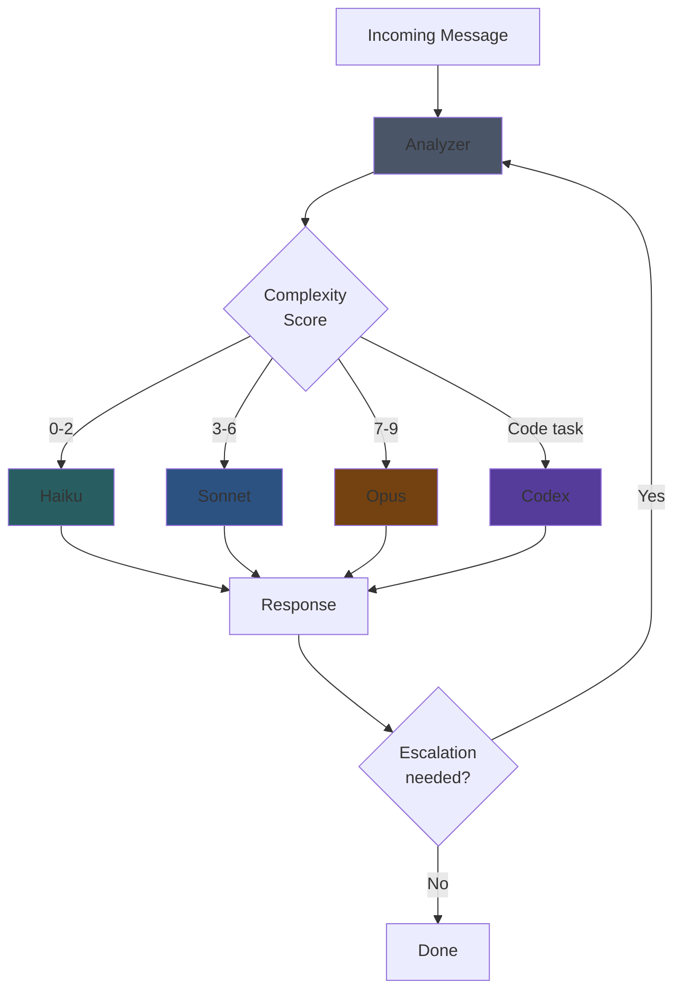
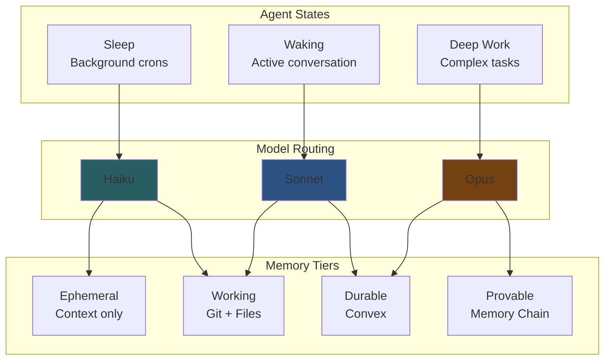

# Intelligent Model Routing System

**Project:** WITNESS / OpenMemory
**Status:** Simplified & Validated
**Date:** 2026-02-02 (Updated)
**Authors:** Klowalski 🐧 + SeMmy

---

## Executive Summary

A **simple, practical** routing system that optimizes AI costs without over-engineering. After discussion and feedback from GPT-4 and Gemini, we've moved from a complex analyzer-based approach to a straightforward pattern + context-aware system.

**Key insight from review:** Context caching changes everything. A cached Sonnet turn (~$0.05) is cheaper than a fresh Haiku turn with full context reload. Stay sticky, don't switch models mid-session.

---

## TL;DR — The Simplified Approach

After review, we're NOT building:
- ❌ Analyzer model (Haiku) to score complexity
- ❌ Dynamic mid-session model switching
- ❌ Complex escalation triggers
- ❌ Learning/optimization layer

We ARE doing:
- ✅ **Sonnet as sticky default** (context caching makes this cheaper than switching)
- ✅ **Haiku for isolated crons** (memory tasks, background jobs — no context)
- ✅ **Opus on explicit request** only
- ✅ **Codex for implementation** (FREE via ChatGPT Plus)

**Why simplify?** Context caching means a cached Sonnet turn (~$0.05) beats a fresh Haiku turn (~$0.10) after a model switch. Switching breaks the cache. Stay sticky.

---

## The Problem

### Current State: Tools, Not Assistants

```
User → Opens ChatGPT → Asks question → Gets answer → Closes
```

- **Stateless**: No memory between sessions
- **Reactive**: Only responds when prompted
- **Single-tier**: One model for all tasks
- **Expensive**: Premium models for everything OR limited capabilities

### The Vision: Personal AI Assistants

```
AI runs continuously → Learns patterns → Proactive → Remembers → Helps with everything
```

- **Stateful**: Memory persists and evolves
- **Proactive**: Background tasks, reminders, anticipation
- **Multi-tier**: Right model for each task
- **Economical**: Smart routing keeps costs sustainable

---

## The Solution: Brain-Inspired Model Routing

### Human Brain Analogy

The brain doesn't use "full consciousness" for everything:

| Brain State | Energy Use | Tasks |
|-------------|------------|-------|
| Sleep (consolidation) | Very low | Memory processing, cleanup |
| Resting (default mode) | Low | Background monitoring |
| Active (focused) | Medium | Normal work, conversation |
| Deep thought | High | Complex reasoning, planning |
| Flow state | Very high | Peak performance, creativity |

**Key insight:** The brain dynamically allocates resources based on task demands. We should do the same with AI models.

### Model Tiers (Brain-Mapped)



| Brain State | Model | Cost/1M in | Use Case |
|-------------|-------|------------|----------|
| **Sleep** | Haiku | $0.25 | Memory consolidation, summarization |
| **Resting** | Haiku | $0.25 | Heartbeat checks, simple queries |
| **Active** | Sonnet | $3.00 | General work, coding, analysis |
| **Deep thought** | Opus | $15.00 | Architecture, planning, hard problems |
| **Execution** | Codex | FREE | Code implementation (via Plus sub) |

---

## Technical Architecture

### Routing Flow



### Complexity Scoring Algorithm

```typescript
interface TaskAnalysis {
  complexity: number;      // 0-9 scale
  taskType: TaskType;
  confidence: number;      // 0-1
  escalationRisk: number;  // 0-1
}

type TaskType = 
  | 'simple_query'      // weather, time, lookups
  | 'file_operation'    // read, list, basic write
  | 'conversation'      // chat, Q&A
  | 'analysis'          // review, summarize
  | 'coding'            // implementation
  | 'planning'          // architecture, design
  | 'reasoning'         // complex logic, multi-step
  | 'research'          // deep investigation
  | 'creative';         // writing, ideation

function analyzeTask(message: string, context: Context): TaskAnalysis {
  // Pattern-based initial classification
  const patterns = detectPatterns(message);
  
  // Context signals
  const contextSignals = {
    codeBlocksPresent: context.hasCode,
    toolCallsExpected: patterns.likelyTools,
    multiStepRequired: patterns.multiStep,
    uncertaintyPresent: patterns.uncertainty,
    previousEscalations: context.escalationCount,
  };
  
  // Complexity scoring
  let complexity = 0;
  
  // Simple queries
  if (patterns.isSimpleQuery) complexity = 1;
  
  // File operations
  else if (patterns.isFileOp && !patterns.isComplexFileOp) complexity = 2;
  
  // General conversation
  else if (patterns.isConversation) complexity = 3;
  
  // Analysis tasks
  else if (patterns.isAnalysis) complexity = 5;
  
  // Coding tasks
  else if (patterns.isCoding) complexity = 6;
  
  // Planning/architecture
  else if (patterns.isPlanning) complexity = 7;
  
  // Complex reasoning
  else if (patterns.isReasoning || patterns.multiStep) complexity = 8;
  
  // Research/creative
  else if (patterns.isResearch || patterns.isCreative) complexity = 8;
  
  // Boost for explicit requests
  if (patterns.explicitOpusRequest) complexity = 9;
  if (patterns.explicitSonnetRequest) complexity = 5;
  
  return {
    complexity,
    taskType: inferTaskType(patterns),
    confidence: calculateConfidence(patterns),
    escalationRisk: estimateEscalationRisk(patterns, context),
  };
}
```

### Escalation Triggers

The system can escalate mid-task if needed:

```typescript
interface EscalationSignal {
  trigger: 'confidence_low' | 'tool_failed' | 'user_request' | 'complexity_spike';
  currentModel: Model;
  suggestedModel: Model;
  reason: string;
}

function checkEscalation(response: Response, context: Context): EscalationSignal | null {
  // Low confidence in own response
  if (response.confidenceScore < 0.6) {
    return { trigger: 'confidence_low', suggestedModel: 'opus', ... };
  }
  
  // Tool call failed
  if (response.toolCallFailed && context.retryCount > 1) {
    return { trigger: 'tool_failed', suggestedModel: 'opus', ... };
  }
  
  // Explicit user request
  if (response.userRequestedUpgrade) {
    return { trigger: 'user_request', suggestedModel: 'opus', ... };
  }
  
  // Task more complex than initially estimated
  if (response.actualComplexity > context.estimatedComplexity + 2) {
    return { trigger: 'complexity_spike', suggestedModel: 'opus', ... };
  }
  
  return null;
}
```

---

## Configuration Schema

### Declarative Tier Configuration

```yaml
models:
  routing:
    enabled: true
    strategy: 'intelligent'  # 'intelligent' | 'cost' | 'capability' | 'manual'
    
    # Analyzer model (cheap, fast)
    analyzer:
      model: 'anthropic/claude-3-5-haiku-latest'
      maxTokens: 100
      skipForSimple: true  # Don't analyze obvious simple queries
    
    # Model tiers
    tiers:
      - name: 'minimal'
        complexity: [0, 2]
        models: ['anthropic/claude-3-5-haiku-latest']
        costPer1M: 0.25
        
      - name: 'standard'
        complexity: [3, 6]
        models: ['anthropic/claude-sonnet-4-5', 'openai/gpt-4o']
        costPer1M: 3.00
        
      - name: 'advanced'
        complexity: [7, 9]
        models: ['anthropic/claude-opus-4-5', 'openai/o1']
        costPer1M: 15.00
        
      - name: 'execution'
        taskTypes: ['coding']
        models: ['openai/codex']
        costPer1M: 0  # Free via Plus
    
    # Escalation settings
    escalation:
      enabled: true
      maxEscalations: 2
      triggers:
        - confidence_low
        - tool_failed
        - user_request
    
    # Pattern overrides
    overrides:
      # Always use Opus for these patterns
      forceAdvanced:
        - 'think hard about'
        - 'use opus'
        - 'architecture'
        - 'design system'
      
      # Always use Haiku for these
      forceMinimal:
        - 'what time'
        - 'weather'
        - '/status'
```

### Per-Agent Overrides

```yaml
agents:
  defaults:
    model:
      routing: 'intelligent'
      
  specific:
    # Heartbeat agent always uses cheap model
    heartbeat:
      model:
        routing: 'manual'
        primary: 'anthropic/claude-3-5-haiku-latest'
    
    # Sub-agents use standard by default
    subagents:
      model:
        routing: 'intelligent'
        maxTier: 'standard'  # Don't escalate to advanced
```

---

## Integration with Memory System

### Brain States + Model Tiers + Memory Tiers



### Cron Jobs with Model Routing

```yaml
# Memory checkpoint (cheap, frequent)
memory-checkpoint:
  schedule:
    kind: every
    everyMs: 3600000  # hourly
  model:
    routing: manual
    primary: anthropic/claude-3-5-haiku-latest
  payload:
    kind: agentTurn
    message: "Memory checkpoint task..."

# Memory curation (smarter, weekly)
memory-curation:
  schedule:
    kind: cron
    expr: "0 10 * * 0"
  model:
    routing: intelligent
    maxTier: standard  # Sonnet max
  payload:
    kind: agentTurn
    message: "Weekly memory curation..."

# Complex analysis (when needed)
complex-analysis:
  schedule:
    kind: cron
    expr: "0 2 * * 1"  # Monday 2am
  model:
    routing: intelligent
    # No maxTier - can escalate to Opus if needed
  payload:
    kind: agentTurn
    message: "Deep analysis of past week..."
```

---

## Economic Analysis (Revised)

### The Context Caching Factor

**Critical insight:** Anthropic's context caching changes the economics entirely.

| Scenario | Input Cost/1M | With 90% Cache |
|----------|---------------|----------------|
| Sonnet (fresh) | $3.00 | - |
| Sonnet (cached) | $3.00 | **$0.30** |
| Haiku (fresh) | $0.25 | - |
| Haiku (cached) | $0.25 | **$0.025** |

**The key realization:** Switching models breaks the cache. A cached Sonnet turn (~$0.05) beats a fresh Haiku turn with context reload (~$0.10).

### Simplified Strategy Economics

**Our actual approach:**

| Use Case | Model | Context | Cost/Turn Est. |
|----------|-------|---------|----------------|
| Main session (ongoing) | Sonnet | Cached | ~$0.05 |
| Heartbeat (isolated) | Haiku | Fresh, minimal | ~$0.01 |
| Memory cron (isolated) | Haiku | Fresh | ~$0.03 |
| Implementation | Codex | N/A | **$0.00** |
| Complex (rare) | Opus | Cached | ~$0.50 |

**Realistic daily distribution (100 turns):**
- 80 turns: Sonnet (cached) = 80 × $0.05 = $4.00
- 15 turns: Heartbeats/crons = 15 × $0.02 = $0.30
- 3 turns: Opus = 3 × $0.50 = $1.50
- 2 turns: Codex = FREE

**Daily: ~$5.80 | Monthly: ~$175**

### Comparison

| Strategy | Monthly Cost |
|----------|--------------|
| All Opus | $4,500 |
| All Sonnet (no caching) | $900 |
| **Simplified routing** | **~$175** |
| Theoretical optimal | ~$90 |

**We get 96% of Opus-level capability at 4% of the cost.**

### Why Not Micro-Optimize?

We considered aggressive model switching (Haiku for simple queries, etc.) but:

1. **Cache breaks cost more than savings** — Switching to Haiku saves $0.05 but reloading context later costs $0.10+
2. **Complexity adds bugs** — Analyzer model, escalation logic = more failure modes
3. **80/20 rule** — Simple sticky sessions capture most savings
4. **Codex is FREE** — Biggest savings come from offloading implementation, not model switching

---

## Implementation Plan (Simplified)

### ✅ Phase 1: Sticky Session Defaults (DONE)
**Timeline:** Immediate
**Effort:** Config change only

```yaml
# OpenClaw config
agents:
  defaults:
    model:
      primary: anthropic/claude-sonnet-4-5     # Main session
      fallback: anthropic/claude-opus-4-5      # On explicit /opus
      heartbeat: anthropic/claude-3-5-haiku-latest  # Heartbeats
```

**Rules:**
- Main session stays on Sonnet (context caching benefit)
- Heartbeats use Haiku (isolated, no context)
- Opus only on explicit `/opus` or `/reasoning` command
- Codex for implementation work (see below)

### ✅ Phase 2: Codex Integration (DONE)
**Timeline:** Same day
**Effort:** One-time auth setup

**Setup completed:**
- Codex CLI v0.93.0 installed
- Auth persists in `~/.codex/auth.json`
- Model: `gpt-5.2-codex` (FREE via Plus)
- No dedicated workspace needed

**Workflow:**
```bash
# From any git repo
cd ~/project && codex --full-auto "implement feature X"

# Or via Klowalski (PTY required)
exec(command="cd ~/repo && codex --full-auto 'task'", pty=true)
```

**Division of labor:**
| Task | Model |
|------|-------|
| Planning, architecture, review | Klowalski (Sonnet/Opus) |
| Implementation, boilerplate, tests | Codex (FREE) |
| Debugging, coordination | Klowalski (Sonnet) |

### Phase 3: Isolated Crons for Memory (TODO)
**Timeline:** When auto-memory lands
**Effort:** Low

Memory maintenance runs in isolated sessions with Haiku:

```yaml
crons:
  memory-consolidation:
    schedule: { kind: cron, expr: "0 4 * * *" }
    sessionTarget: isolated
    payload:
      kind: agentTurn
      model: anthropic/claude-3-5-haiku-latest
      message: "Consolidate yesterday's memories..."
```

**Why isolated?** No context to cache. Fresh Haiku is cheapest.

### Phase 4: MAYBE Later — Pattern Overrides
**Timeline:** If needed
**Effort:** Low

Only if we see clear patterns worth automating:

```typescript
// Simple, optional overrides
function maybeOverride(message: string): Model | null {
  if (/use opus|think hard/i.test(message)) return 'opus';
  if (/\/haiku/i.test(message)) return 'haiku';
  return null; // stick with session default
}
```

### ~~Phase X: Complex Analyzer~~ (CANCELLED)
We're NOT building:
- Complexity scoring
- Analyzer model
- Dynamic escalation
- Learning layer

**Reason:** Over-engineering. Context caching makes simple sticky sessions optimal.

---

## Repository Structure Changes

### Proposed Structure

```
witness-protocol/
├── specs/
│   ├── WITNESS-PROTOCOL.md       # Token anchoring spec
│   ├── MEMORY-ARCHITECTURE.md    # Brain-inspired memory tiers
│   └── INTELLIGENT-ROUTING.md    # Model routing spec (NEW)
│
├── packages/
│   ├── memory-chain/             # Cryptographic memory chain
│   │   ├── src/
│   │   └── package.json
│   │
│   ├── model-router/             # Intelligent routing (NEW)
│   │   ├── src/
│   │   │   ├── analyzer.ts       # Task complexity analyzer
│   │   │   ├── router.ts         # Model selection logic
│   │   │   ├── escalation.ts     # Mid-task escalation
│   │   │   └── patterns.ts       # Pattern matching rules
│   │   └── package.json
│   │
│   └── memory-sync/              # Convex sync layer (FUTURE)
│       ├── src/
│       └── package.json
│
├── skills/
│   ├── memory-chain/             # OpenClaw skill for memory
│   └── model-routing/            # OpenClaw skill for routing (NEW)
│
├── docs/
│   ├── brain-analogy.md          # Conceptual explanation
│   ├── getting-started.md
│   └── api-reference.md
│
└── examples/
    ├── basic-routing/
    ├── memory-integration/
    └── full-assistant/
```

### Key New Components

1. **model-router package**
   - Standalone TypeScript library
   - Can be used independently of OpenClaw
   - Provides: analyzer, router, escalation logic

2. **model-routing skill**
   - OpenClaw integration
   - Hooks into message handling
   - Uses model-router package

3. **specs/INTELLIGENT-ROUTING.md**
   - Full specification
   - Algorithm details
   - Configuration reference

---

## Open Questions (Resolved)

1. **Analyzer overhead**: ~~Is it worth using Haiku to analyze tasks?~~ 
   → **No.** Pattern matching sufficient. Analyzer adds latency without proportional benefit.

2. **Cross-provider routing**: ~~How do we handle routing between providers?~~
   → **Stay in Anthropic family** for main session (prompt dialect consistency). Codex (OpenAI) is fine for isolated coding tasks.

3. **Escalation UX**: ~~Should users be notified when escalation happens?~~
   → **N/A.** No auto-escalation. User explicitly requests Opus when needed.

4. **Learning from mistakes**: ~~How do we track suboptimal routing?~~
   → **Deferred.** Simple approach first. Track manually if issues arise.

5. **Integration depth**: ~~Core feature or plugin?~~
   → **Config-level.** Just model settings in OpenClaw config. No special integration needed.

---

## Codex Integration Details

### Setup (Completed 2026-02-02)

```bash
# Install (done)
npm install -g @openai/codex

# Auth (done via device code flow)
# Stored in: ~/.codex/auth.json
# Model: gpt-5.2-codex (included with ChatGPT Plus)
```

### Usage Patterns

**One-shot (preferred for automation):**
```bash
cd ~/project && codex --full-auto "implement feature X"
```

**Interactive (for exploration):**
```bash
cd ~/project && codex
```

**From Klowalski (requires PTY):**
```bash
exec(command="cd ~/repo && codex --full-auto 'task'", pty=true, background=true)
```

### Workflow

1. **Klowalski plans** — Architecture, design, specs
2. **Klowalski creates task** — Clear, specific prompt
3. **Codex implements** — Code generation, tests, boilerplate
4. **Klowalski reviews** — Quality check, integration
5. **Commit** — Standard git workflow

### Cost Impact

- Codex is **FREE** with ChatGPT Plus ($20/mo)
- Offloads ~30-50% of coding work from Claude
- Biggest single cost reduction in the system

---

## Success Metrics

| Metric | Target |
|--------|--------|
| Cost reduction vs all-Opus | > 70% |
| Task success rate | > 95% |
| Unnecessary escalations | < 10% |
| User satisfaction | > 4.5/5 |
| Latency overhead | < 200ms |

---

## Decisions Made (2026-02-02)

After review with GPT-4 and Gemini Flash, the following decisions were made:

### ✅ Accepted
1. **Sonnet as default** — Context caching makes this optimal
2. **Haiku for isolated sessions only** — Crons, memory tasks
3. **Opus on explicit request** — No auto-escalation
4. **Codex for implementation** — FREE via Plus subscription

### ❌ Rejected
1. **Analyzer model** — Adds latency, cost, complexity for marginal benefit
2. **Complexity scoring** — Over-engineered; patterns sufficient
3. **Dynamic escalation** — Breaking cache costs more than potential savings
4. **Learning layer** — Premature optimization

### 🔄 Deferred
1. **Pattern overrides** — Maybe later if clear needs emerge
2. **Cross-provider routing** — Staying in Anthropic family for now (prompt dialect consistency)
3. **User-facing routing UI** — Not needed for single-user setup

---

## Next Steps

1. [x] Review this proposal with GPT/Gemini ✓
2. [x] Simplify based on feedback ✓
3. [x] Update spec with decisions ✓
4. [x] Set up Codex CLI ✓
5. [ ] Configure OpenClaw with simplified routing
6. [ ] Test Codex workflow on real tasks
7. [ ] Implement auto-memory crons (when ready)

---

## Appendix: Token Economics

### Why Model Switching Doesn't "Burn" Extra Tokens

LLM APIs are stateless. Every request sends the full conversation history.

```
Turn 1: Send 20k context → Model A → Response
Turn 2: Send 25k context → Model A → Response
Turn 3: Send 30k context → Model B → Response  ← Model switch
Turn 4: Send 35k context → Model B → Response
```

The context is sent every turn regardless. Model switching just changes the pricing tier, not the token count.

**Cost difference is purely in pricing:**
- 95k context on Sonnet: $0.285
- 95k context on Opus: $1.425
- **Difference: $1.14** (Opus premium, not switching penalty)

---

*Document created: 2026-02-02*
*For review by: GPT, Gemini, Claude, and human collaborators*
