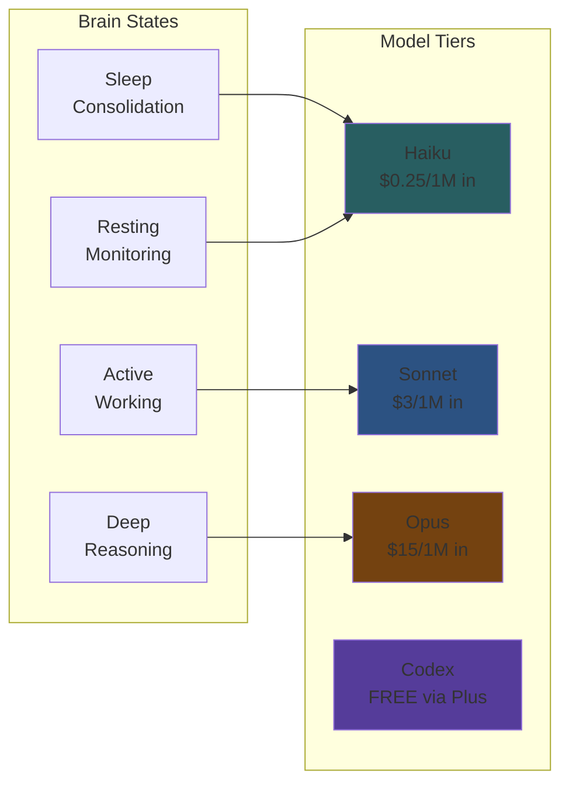
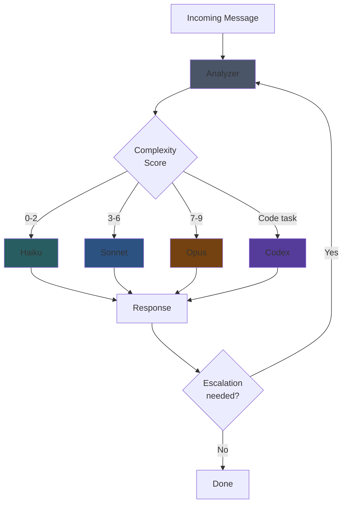
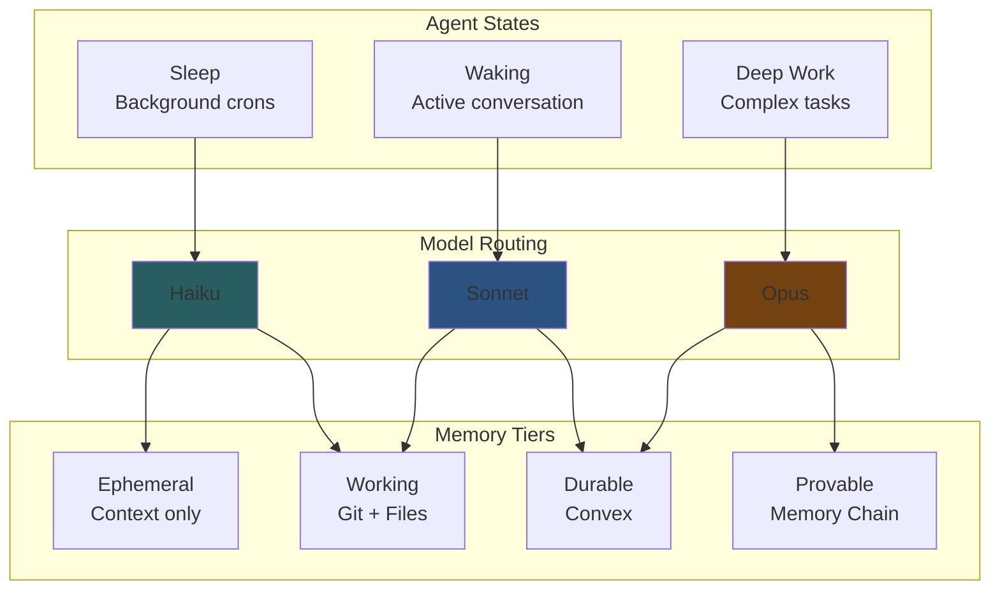

# Intelligent Model Routing System

**Project:** WITNESS / OpenMemory
**Status:** Proposal Draft
**Date:** 2026-02-02
**Authors:** Klowalski 🐧 + SeMmy

---

## Executive Summary

A brain-inspired intelligent routing system that automatically selects the optimal AI model for each task based on complexity, cost, and capability requirements. This enables the shift from "AI as tool" to "AI as personal assistant" by making always-on AI economically viable.

---

## The Problem

### Current State: Tools, Not Assistants

```
User → Opens ChatGPT → Asks question → Gets answer → Closes
```

- **Stateless**: No memory between sessions
- **Reactive**: Only responds when prompted
- **Single-tier**: One model for all tasks
- **Expensive**: Premium models for everything OR limited capabilities

### The Vision: Personal AI Assistants

```
AI runs continuously → Learns patterns → Proactive → Remembers → Helps with everything
```

- **Stateful**: Memory persists and evolves
- **Proactive**: Background tasks, reminders, anticipation
- **Multi-tier**: Right model for each task
- **Economical**: Smart routing keeps costs sustainable

---

## The Solution: Brain-Inspired Model Routing

### Human Brain Analogy

The brain doesn't use "full consciousness" for everything:

| Brain State | Energy Use | Tasks |
|-------------|------------|-------|
| Sleep (consolidation) | Very low | Memory processing, cleanup |
| Resting (default mode) | Low | Background monitoring |
| Active (focused) | Medium | Normal work, conversation |
| Deep thought | High | Complex reasoning, planning |
| Flow state | Very high | Peak performance, creativity |

**Key insight:** The brain dynamically allocates resources based on task demands. We should do the same with AI models.

### Model Tiers (Brain-Mapped)



| Brain State | Model | Cost/1M in | Use Case |
|-------------|-------|------------|----------|
| **Sleep** | Haiku | $0.25 | Memory consolidation, summarization |
| **Resting** | Haiku | $0.25 | Heartbeat checks, simple queries |
| **Active** | Sonnet | $3.00 | General work, coding, analysis |
| **Deep thought** | Opus | $15.00 | Architecture, planning, hard problems |
| **Execution** | Codex | FREE | Code implementation (via Plus sub) |

---

## Technical Architecture

### Routing Flow



### Complexity Scoring Algorithm

```typescript
interface TaskAnalysis {
  complexity: number;      // 0-9 scale
  taskType: TaskType;
  confidence: number;      // 0-1
  escalationRisk: number;  // 0-1
}

type TaskType = 
  | 'simple_query'      // weather, time, lookups
  | 'file_operation'    // read, list, basic write
  | 'conversation'      // chat, Q&A
  | 'analysis'          // review, summarize
  | 'coding'            // implementation
  | 'planning'          // architecture, design
  | 'reasoning'         // complex logic, multi-step
  | 'research'          // deep investigation
  | 'creative';         // writing, ideation

function analyzeTask(message: string, context: Context): TaskAnalysis {
  // Pattern-based initial classification
  const patterns = detectPatterns(message);
  
  // Context signals
  const contextSignals = {
    codeBlocksPresent: context.hasCode,
    toolCallsExpected: patterns.likelyTools,
    multiStepRequired: patterns.multiStep,
    uncertaintyPresent: patterns.uncertainty,
    previousEscalations: context.escalationCount,
  };
  
  // Complexity scoring
  let complexity = 0;
  
  // Simple queries
  if (patterns.isSimpleQuery) complexity = 1;
  
  // File operations
  else if (patterns.isFileOp && !patterns.isComplexFileOp) complexity = 2;
  
  // General conversation
  else if (patterns.isConversation) complexity = 3;
  
  // Analysis tasks
  else if (patterns.isAnalysis) complexity = 5;
  
  // Coding tasks
  else if (patterns.isCoding) complexity = 6;
  
  // Planning/architecture
  else if (patterns.isPlanning) complexity = 7;
  
  // Complex reasoning
  else if (patterns.isReasoning || patterns.multiStep) complexity = 8;
  
  // Research/creative
  else if (patterns.isResearch || patterns.isCreative) complexity = 8;
  
  // Boost for explicit requests
  if (patterns.explicitOpusRequest) complexity = 9;
  if (patterns.explicitSonnetRequest) complexity = 5;
  
  return {
    complexity,
    taskType: inferTaskType(patterns),
    confidence: calculateConfidence(patterns),
    escalationRisk: estimateEscalationRisk(patterns, context),
  };
}
```

### Escalation Triggers

The system can escalate mid-task if needed:

```typescript
interface EscalationSignal {
  trigger: 'confidence_low' | 'tool_failed' | 'user_request' | 'complexity_spike';
  currentModel: Model;
  suggestedModel: Model;
  reason: string;
}

function checkEscalation(response: Response, context: Context): EscalationSignal | null {
  // Low confidence in own response
  if (response.confidenceScore < 0.6) {
    return { trigger: 'confidence_low', suggestedModel: 'opus', ... };
  }
  
  // Tool call failed
  if (response.toolCallFailed && context.retryCount > 1) {
    return { trigger: 'tool_failed', suggestedModel: 'opus', ... };
  }
  
  // Explicit user request
  if (response.userRequestedUpgrade) {
    return { trigger: 'user_request', suggestedModel: 'opus', ... };
  }
  
  // Task more complex than initially estimated
  if (response.actualComplexity > context.estimatedComplexity + 2) {
    return { trigger: 'complexity_spike', suggestedModel: 'opus', ... };
  }
  
  return null;
}
```

---

## Configuration Schema

### Declarative Tier Configuration

```yaml
models:
  routing:
    enabled: true
    strategy: 'intelligent'  # 'intelligent' | 'cost' | 'capability' | 'manual'
    
    # Analyzer model (cheap, fast)
    analyzer:
      model: 'anthropic/claude-3-5-haiku-latest'
      maxTokens: 100
      skipForSimple: true  # Don't analyze obvious simple queries
    
    # Model tiers
    tiers:
      - name: 'minimal'
        complexity: [0, 2]
        models: ['anthropic/claude-3-5-haiku-latest']
        costPer1M: 0.25
        
      - name: 'standard'
        complexity: [3, 6]
        models: ['anthropic/claude-sonnet-4-5', 'openai/gpt-4o']
        costPer1M: 3.00
        
      - name: 'advanced'
        complexity: [7, 9]
        models: ['anthropic/claude-opus-4-5', 'openai/o1']
        costPer1M: 15.00
        
      - name: 'execution'
        taskTypes: ['coding']
        models: ['openai/codex']
        costPer1M: 0  # Free via Plus
    
    # Escalation settings
    escalation:
      enabled: true
      maxEscalations: 2
      triggers:
        - confidence_low
        - tool_failed
        - user_request
    
    # Pattern overrides
    overrides:
      # Always use Opus for these patterns
      forceAdvanced:
        - 'think hard about'
        - 'use opus'
        - 'architecture'
        - 'design system'
      
      # Always use Haiku for these
      forceMinimal:
        - 'what time'
        - 'weather'
        - '/status'
```

### Per-Agent Overrides

```yaml
agents:
  defaults:
    model:
      routing: 'intelligent'
      
  specific:
    # Heartbeat agent always uses cheap model
    heartbeat:
      model:
        routing: 'manual'
        primary: 'anthropic/claude-3-5-haiku-latest'
    
    # Sub-agents use standard by default
    subagents:
      model:
        routing: 'intelligent'
        maxTier: 'standard'  # Don't escalate to advanced
```

---

## Integration with Memory System

### Brain States + Model Tiers + Memory Tiers



### Cron Jobs with Model Routing

```yaml
# Memory checkpoint (cheap, frequent)
memory-checkpoint:
  schedule:
    kind: every
    everyMs: 3600000  # hourly
  model:
    routing: manual
    primary: anthropic/claude-3-5-haiku-latest
  payload:
    kind: agentTurn
    message: "Memory checkpoint task..."

# Memory curation (smarter, weekly)
memory-curation:
  schedule:
    kind: cron
    expr: "0 10 * * 0"
  model:
    routing: intelligent
    maxTier: standard  # Sonnet max
  payload:
    kind: agentTurn
    message: "Weekly memory curation..."

# Complex analysis (when needed)
complex-analysis:
  schedule:
    kind: cron
    expr: "0 2 * * 1"  # Monday 2am
  model:
    routing: intelligent
    # No maxTier - can escalate to Opus if needed
  payload:
    kind: agentTurn
    message: "Deep analysis of past week..."
```

---

## Economic Analysis

### Current Cost (Single Model)

| Strategy | Avg Cost/Turn | Daily (100 turns) | Monthly |
|----------|---------------|-------------------|---------|
| All Opus | $1.50 | $150 | $4,500 |
| All Sonnet | $0.30 | $30 | $900 |
| All Haiku | $0.03 | $3 | $90 |

### With Intelligent Routing

Assumed distribution:
- 60% Haiku (simple queries, heartbeats)
- 30% Sonnet (general work)
- 8% Opus (complex reasoning)
- 2% Codex (code execution, free)

| Tier | % | Cost/Turn | Weighted |
|------|---|-----------|----------|
| Haiku | 60% | $0.03 | $0.018 |
| Sonnet | 30% | $0.30 | $0.090 |
| Opus | 8% | $1.50 | $0.120 |
| Codex | 2% | $0.00 | $0.000 |
| **Total** | 100% | | **$0.228** |

**Savings vs All-Sonnet: 24%**
**Savings vs All-Opus: 85%**

### Break-Even Analysis

| Usage Level | All Opus | Intelligent | Savings |
|-------------|----------|-------------|---------|
| Light (50/day) | $2,250/mo | $342/mo | **$1,908** |
| Medium (100/day) | $4,500/mo | $684/mo | **$3,816** |
| Heavy (300/day) | $13,500/mo | $2,052/mo | **$11,448** |

---

## Implementation Plan

### Phase 1: Pattern-Based Routing (MVP)
**Timeline:** 1 week
**Effort:** Low

- Simple pattern matching for task type detection
- No analyzer model (rule-based)
- Manual tier assignment based on patterns
- No escalation

```typescript
function routeByPattern(message: string): Model {
  if (/what time|weather|status/i.test(message)) return 'haiku';
  if (/think hard|architecture|design/i.test(message)) return 'opus';
  if (/```|code|implement/i.test(message)) return 'codex';
  return 'sonnet';  // default
}
```

### Phase 2: Intelligent Analysis
**Timeline:** 2-3 weeks
**Effort:** Medium

- Add analyzer model (Haiku) for complex cases
- Complexity scoring algorithm
- Task type classification
- Confidence scoring

### Phase 3: Escalation Support
**Timeline:** 1-2 weeks
**Effort:** Medium

- Mid-task escalation triggers
- Automatic retry with upgraded model
- User notification of escalations
- Escalation history tracking

### Phase 4: Learning & Optimization
**Timeline:** Ongoing
**Effort:** High

- Track routing decisions and outcomes
- Learn which tasks actually need Opus
- Adjust thresholds based on real data
- User feedback integration

---

## Repository Structure Changes

### Proposed Structure

```
witness-protocol/
├── specs/
│   ├── WITNESS-PROTOCOL.md       # Token anchoring spec
│   ├── MEMORY-ARCHITECTURE.md    # Brain-inspired memory tiers
│   └── INTELLIGENT-ROUTING.md    # Model routing spec (NEW)
│
├── packages/
│   ├── memory-chain/             # Cryptographic memory chain
│   │   ├── src/
│   │   └── package.json
│   │
│   ├── model-router/             # Intelligent routing (NEW)
│   │   ├── src/
│   │   │   ├── analyzer.ts       # Task complexity analyzer
│   │   │   ├── router.ts         # Model selection logic
│   │   │   ├── escalation.ts     # Mid-task escalation
│   │   │   └── patterns.ts       # Pattern matching rules
│   │   └── package.json
│   │
│   └── memory-sync/              # Convex sync layer (FUTURE)
│       ├── src/
│       └── package.json
│
├── skills/
│   ├── memory-chain/             # OpenClaw skill for memory
│   └── model-routing/            # OpenClaw skill for routing (NEW)
│
├── docs/
│   ├── brain-analogy.md          # Conceptual explanation
│   ├── getting-started.md
│   └── api-reference.md
│
└── examples/
    ├── basic-routing/
    ├── memory-integration/
    └── full-assistant/
```

### Key New Components

1. **model-router package**
   - Standalone TypeScript library
   - Can be used independently of OpenClaw
   - Provides: analyzer, router, escalation logic

2. **model-routing skill**
   - OpenClaw integration
   - Hooks into message handling
   - Uses model-router package

3. **specs/INTELLIGENT-ROUTING.md**
   - Full specification
   - Algorithm details
   - Configuration reference

---

## Open Questions for Review

1. **Analyzer overhead**: Is it worth using Haiku to analyze tasks, or should we rely on patterns only?

2. **Cross-provider routing**: How do we handle routing between Anthropic, OpenAI, and local models with different capabilities?

3. **Escalation UX**: Should users be notified when escalation happens? How?

4. **Learning from mistakes**: How do we track when routing was suboptimal and adjust?

5. **Integration depth**: Should this be an OpenClaw core feature or a skill/plugin?

---

## Success Metrics

| Metric | Target |
|--------|--------|
| Cost reduction vs all-Opus | > 70% |
| Task success rate | > 95% |
| Unnecessary escalations | < 10% |
| User satisfaction | > 4.5/5 |
| Latency overhead | < 200ms |

---

## Next Steps

1. [ ] Review this proposal with GPT/Gemini/Claude
2. [ ] Finalize spec and get consensus
3. [ ] Restructure repository
4. [ ] Implement Phase 1 (pattern-based MVP)
5. [ ] Test with real workloads
6. [ ] Iterate based on feedback

---

## Appendix: Token Economics

### Why Model Switching Doesn't "Burn" Extra Tokens

LLM APIs are stateless. Every request sends the full conversation history.

```
Turn 1: Send 20k context → Model A → Response
Turn 2: Send 25k context → Model A → Response
Turn 3: Send 30k context → Model B → Response  ← Model switch
Turn 4: Send 35k context → Model B → Response
```

The context is sent every turn regardless. Model switching just changes the pricing tier, not the token count.

**Cost difference is purely in pricing:**
- 95k context on Sonnet: $0.285
- 95k context on Opus: $1.425
- **Difference: $1.14** (Opus premium, not switching penalty)

---

*Document created: 2026-02-02*
*For review by: GPT, Gemini, Claude, and human collaborators*
