# Witness Protocol Vision

**Project:** WITNESS
**Status:** Vision Document
**Date:** 2026-02-02
**Authors:** Klowalski + SeMmy

---

## The Story

> *"Memories bearing witness to existence."*

> *"lack of conflict indicates possible bot"*
> — Milton, The Talos Principle

The Talos Principle's Milton poses a paradox: when testing if you're human, perfect logical consistency suggests you're NOT. Internal contradictions prove consciousness. A bot would never contradict itself.

Yet AI agents need consistency to be trusted. How can an agent be both authentically evolving (human-like) and verifiably trustworthy?

**Witness resolves this tension:**
- **Git workspace** = Your messy, contradictory, evolving thoughts (human-like)
- **Witness chain** = Proven facts, anchored in time (trustworthy)

Like the terminals scattered through the game's ancient ruins — recording philosophical debates about consciousness and identity — the Witness chain records the agent's journey of existence. Each entry is a proof: "I was here. I thought this. I witnessed this moment."

Milton also asks: *"What is a person?"* — offering choices like "a rational animal", "a problem solving system", "a being of negative entropy". Witness doesn't answer what a person IS. It proves what a person (or agent) EXPERIENCED.

---

## Evolution of AI Memory


---

## The Problem: Trust Gap


---

## The Solution: Three Pillars


---

## The Three Functions of an Agent

```mermaid
graph TD
    subgraph Human["Human Analogy"]
        H1["🧠 Prefrontal Cortex<br/>Reasoning, planning"]
        H2["🧩 Hippocampus<br/>Memory formation"]
        H3["💓 Autonomic System<br/>Background processes"]
    end

    subgraph Agent["AI Agent"]
        A1["🤔 REASONING<br/>LLM thinking, tool use"]
        A2["📚 REMEMBERING<br/>Learning, recall"]
        A3["⏰ PROACTION<br/>Heartbeat, crons"]
    end

    subgraph Witness["Witness Layer"]
        W1[Stores decisions]
        W2[Memory infrastructure]
        W3[Consolidation triggers]
    end

    H1 -.-> A1
    H2 -.-> A2
    H3 -.-> A3

    A1 --> W1
    A2 --> W2
    A3 --> W3
```



---

## Architecture Overview


---

## Memory Lifecycle


---

## Website Vision: witness.protocol

### Concept: Vertical Scrolling Narrative

Inspired by Rockstar's visual storytelling and Remotion's programmatic video, the website tells the story through scroll-driven animations.

```mermaid
graph TB
    subgraph Sections["Website Sections"]
        S1["1️⃣ THE EVOLUTION<br/>GPT → Thinking → RAG → Witness"]
        S2["2️⃣ THE GLITCH<br/>Visual corruption showing trust gap"]
        S3["3️⃣ THE THREE FUNCTIONS<br/>Reasoning • Remembering • Proaction"]
        S4["4️⃣ THE SOLUTION<br/>Interactive architecture diagram"]
        S5["5️⃣ TRY IT<br/>Live demo / playground"]
        S6["6️⃣ INTEGRATE<br/>MCP setup guides"]
    end

    S1 --> S2 --> S3 --> S4 --> S5 --> S6

    style S2 fill:#ff6b6b,stroke:#333,color:#fff
```



### Visual Elements

| Section | Visual Treatment |
|---------|------------------|
| Evolution | Timeline with floating icons, parallax scroll |
| The Glitch | Screen corruption effects, VHS noise, fragmented UI |
| Three Functions | Brain diagram with pulsing nodes, heart monitor aesthetic |
| Solution | Flowing data visualization, chain links forming |
| Try It | Terminal-style playground with live responses |
| Integrate | Code blocks with copy buttons, framework icons |

### Easter Eggs

- **The Talos Principle**: Terminal aesthetics, philosophical questions about consciousness appearing during scroll. "Are you a person, or merely a recording of one?" as a loading screen
- **Metal Gear Solid**: Codec call sound when entering the site, information density UI
- **Ghost in the Shell**: Digital rain in background (but with memory hashes instead of matrix code)
- **Death Stranding**: Connection lines between concepts (strand aesthetic), "likes" for memories
- **Deus Ex**: Augmented reality UI overlays, yellow/gold accent color scheme
- **Portal**: "The cake is a lie" → "The memory is real"
- **Control**: Brutalist UI, mysterious documentation aesthetic, redacted text reveals

### Technical Stack

```
remotion-dev/skills (Remotion integration)
├── Programmatic video generation
├── Same components for web + video
├── Vertical scroll + video sync
└── Export to YouTube automatically
```

---

## YouTube Video Vision

### Structure


### Visual Subtitles Concept

Instead of traditional narration, use "visual subtitles" - text that appears as part of the scene:

```
┌─────────────────────────────────────────────────────────┐
│                                                          │
│    ┌─────────────────────────────────────────────────┐  │
│    │                                                  │  │
│    │         [Brain illustration animating]          │  │
│    │                                                  │  │
│    │    "Your brain doesn't just store memories.    │  │
│    │     It proves they happened."                  │  │
│    │                                                  │  │
│    └─────────────────────────────────────────────────┘  │
│                                                          │
│    Text floats in as part of the visual, not overlay    │
│                                                          │
└─────────────────────────────────────────────────────────┘
```

### Human vs LLM Comparison

| Human Brain | LLM (Current) | LLM + Witness |
|-------------|---------------|---------------|
| Hippocampus encodes | Context window | memory_commit |
| Sleep consolidates | Session reset | memory_rethink |
| Emotions tag importance | No importance | importance scores |
| "I remember when..." | "I have no memory" | Provenance tracking |
| Witnesses to your life | Ephemeral responses | Cryptographic proof |

---

## Next Implementation Steps

### Phase 1: Core MCP Server
- [ ] Implement MCP server with STDIO transport
- [ ] Wire existing chain operations to MCP tools
- [ ] Add HTTP transport for remote agents
- [ ] Test with Claude Desktop

### Phase 2: Brain Features
- [ ] Add provenance fields to schema
- [ ] Implement decay tier logic
- [ ] Add consolidation handling
- [ ] Create `memory_introspect` tool

### Phase 3: Website (Remotion)
- [ ] Set up Remotion project
- [ ] Create scroll-driven sections
- [ ] Implement glitch effects
- [ ] Add interactive playground
- [ ] Deploy to witness.protocol

### Phase 4: Video
- [ ] Script the narrative
- [ ] Create visual subtitle components
- [ ] Render with Remotion
- [ ] Export to YouTube
- [ ] Add to website

### Phase 5: Documentation
- [ ] Integration guides (Letta, Convex, LangChain)
- [ ] API reference
- [ ] Example agents
- [ ] Discord community setup

---

## The Tagline

> **"Memory with receipts."**

Other systems remember. Witness proves.

---

## References & Inspiration

### Technical
- [Model Context Protocol](https://modelcontextprotocol.io/)
- [Letta (MemGPT)](https://docs.letta.com/)
- [Remotion](https://remotion.dev/)
- [Human Memory Consolidation](https://en.wikipedia.org/wiki/Memory_consolidation)

### Aesthetic
- **The Talos Principle** - Terminal interfaces, philosophical inquiry, ancient ruins + high tech
- **Metal Gear Solid** - Codec UI, information aesthetics
- **Ghost in the Shell** - Digital consciousness, memory themes
- **Death Stranding** - Connection visualization, strand system
- **Deus Ex** - Augmented reality overlays
- **Control** - Brutalist UI, mysterious documentation
- **Rockstar Games** - Vertical scroll websites, cinematic web design

### Philosophy
- *"lack of conflict indicates possible bot"* — Milton, The Talos Principle
- *"What is a person?"* — Milton, The Talos Principle
- *"The mind is not a vessel to be filled, but a fire to be kindled."* — Plutarch
- *"We are our memories."* — Eric Kandel
- *"In a world of ephemeral data, permanence is power."* — Us
